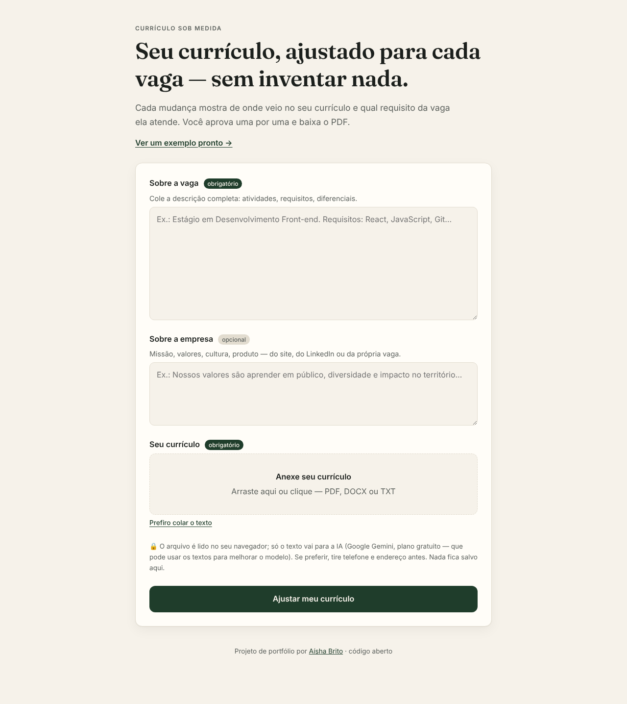
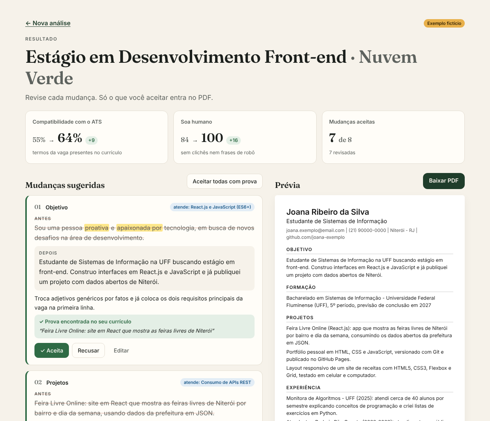

# Currículo Sob Medida

Adapta o seu currículo para cada vaga com IA, **sem inventar nada**. Você cola a vaga, conta (se quiser) sobre a empresa, anexa o currículo, e o site:

- reescreve as linhas que importam para essa vaga, usando os termos que o filtro automático (ATS) procura;
- mostra, para **cada** mudança, a prova no seu currículo original e o requisito da vaga que ela atende;
- deixa você **aceitar, recusar ou editar** frase por frase;
- gera o PDF final só com o que você aprovou.




> Clique em **"Ver um exemplo pronto"** para testar com um currículo fictício, sem precisar de nada.

## O que tem de diferente

A maioria dos "otimizadores de currículo" devolve um texto novo, cheio de palavra-chave e com cara de robô. Aqui a ideia é outra:

| | Como funciona |
|---|---|
| **Mapa de evidências** | A IA precisa citar um trecho literal do seu currículo como prova de cada mudança. O navegador confere se o trecho existe mesmo. Se não existir, a mudança aparece em vermelho: "Não encontramos isso no seu currículo". |
| **Você aprova cada frase** | Antes e depois lado a lado, com aceitar, recusar e editar. Nada entra no PDF sem você aprovar. |
| **Raio-X do ATS** | Mostra quais termos da vaga você já tinha, quais foram adicionados e quais faltam, com a porcentagem antes e depois. A conta é feita no navegador, palavra por palavra, sem "chute" da IA. |
| **Detector de texto robótico** | Destaca clichês ("proativa", "apaixonada por", "sinergia"…) e dá uma nota de "soa humano", com dica do que colocar no lugar. |
| **Plano para as lacunas** | O que a vaga pede e você ainda não mostra vira uma ação concreta e gratuita ("adicione testes com Vitest no projeto X — 2 noites"). A palavra-chave não é enfiada no currículo. |
| **Ponte com a empresa** | Se você contar os valores da empresa, recebe uma frase verdadeira ligando a sua história a eles, uma mensagem para o recrutador e as perguntas prováveis da entrevista. |
| **PDF que o ATS lê** | Uma coluna, só texto, fontes padrão. |

## Como funciona por dentro

```
navegador                                   função na Vercel (/api/analyze)
─────────                                   ──────────────────────────────
PDF/DOCX → texto (pdf.js / mammoth)
vaga + empresa + texto ───────────────────► valida tamanho e limite por IP
                                            Gemini (grátis) ─► se falhar ─► Groq (grátis)
                                            confere e limpa o JSON da IA
◄─────────────────────────────────── seções, sugestões, palavras-chave, lacunas…
confere as provas no texto original
calcula o ATS antes/depois e a nota "soa humano"
você aprova → monta o currículo final → PDF (jsPDF)
```

- **React + Vite + TypeScript**, sem biblioteca de UI.
- **A chave da IA fica no servidor** (função serverless na Vercel). Quem usa o site não precisa de chave nenhuma.
- **IA gratuita:** Google Gemini, com Groq de reserva se o Gemini falhar ou estourar a cota.
- **A resposta da IA é tratada como dado não confiável:** é validada campo a campo (`shared/parseAnalysis.ts`), e o texto do usuário vai entre tags com instrução para ignorar comandos escondidos nele.
- **Privacidade:** o arquivo é lido no navegador e só o texto é enviado. Nada é salvo em servidor; o resultado fica só na aba (`sessionStorage`).

## Rodar no seu computador

```bash
npm install
cp .env.example .env.local   # coloque sua GEMINI_API_KEY (grátis em https://aistudio.google.com/apikey)
npm run dev                  # http://localhost:5173
npm test                     # testes da lógica (provas, ATS, clichês, montagem do currículo)
```

Sem chave, o site funciona normalmente com o exemplo pronto.

## Publicar de graça na Vercel

1. Entre em [vercel.com](https://vercel.com) com o GitHub e importe este repositório (o Vite é detectado sozinho).
2. Em **Settings → Environment Variables**, adicione `GEMINI_API_KEY` (e, se quiser, `GROQ_API_KEY`, de [console.groq.com/keys](https://console.groq.com/keys)).
3. Faça o deploy. Pronto.

Variáveis opcionais: `GEMINI_MODEL` (padrão `gemini-2.5-flash`), `GROQ_MODEL` (padrão `llama-3.3-70b-versatile`) e `RATE_LIMIT_PER_HOUR` (padrão 8 análises por pessoa por hora).

> No plano gratuito do Gemini, o Google pode usar os textos enviados para melhorar os modelos. O site avisa isso na tela inicial.

## Estrutura

```
api/analyze.ts          função serverless (Vercel)
server/                 chamada às IAs, prompt, validação de entrada, limite por IP
shared/                 tipos e validação da resposta da IA (usados nos dois lados)
src/pages/              tela do formulário e tela de resultado
src/lib/                provas, ATS, clichês, montagem do currículo, PDF, leitura de arquivos
src/demo/example.ts     exemplo fictício usado no "Ver um exemplo pronto"
```

---

Feito por [Aísha Brito](https://github.com/aishabrito).
